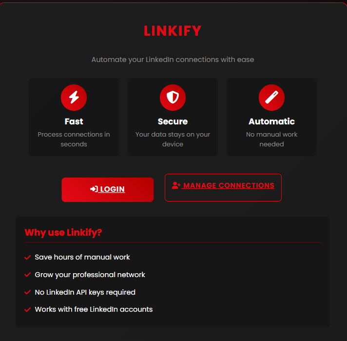

<div align="center">

# 🔗 Linkify
 
### LinkedIn Connection Automation Tool

[](https://www.python.org/)
[](https://flask.palletsprojects.com/)
[](https://www.selenium.dev/)
[](LICENSE)

**[🌐 Live Demo](https://linkify-mjyp.onrender.com/)** • **[📖 Documentation](#-features)** • **[🐛 Report Bug](https://github.com/mugenkyou/Linkify/issues)** • **[✨ Request Feature](https://github.com/mugenkyou/Linkify/issues)**



</div>

---

## 📋 Table of Contents

- [About](#-about)
- [Features](#-features)
- [Tech Stack](#-tech-stack)
- [Getting Started](#-getting-started)
- [Usage](#-usage)
- [Project Structure](#-project-structure)
- [Deployment](#-deployment)
- [Security](#-security--privacy)
- [Contributing](#-contributing)
- [License](#-license)
- [Contact](#-contact)

---

## 🎯 About

**Linkify** is a secure and efficient web-based tool designed to automate LinkedIn connection management. Built with Flask and Selenium, it provides a user-friendly interface for managing your professional network, automating the acceptance of connection requests while maintaining security and privacy.

### Why Linkify?

- ⚡ **Save Time**: Automate repetitive connection management tasks
- 🔒 **Stay Secure**: Local session storage with no data collection
- 🎨 **Modern UI**: Clean, responsive interface that works on all devices
- 🚀 **Easy Deploy**: Ready for cloud deployment with one-click setup

---

## ✨ Features

<table>
<tr>
<td width="50%">

### 🔐 Authentication
- LinkedIn login with OTP support
- Session cookie persistence
- Secure credential handling
- Auto-relogin capability

</td>
<td width="50%">

### 🤖 Automation
- Batch accept connections
- Real-time progress tracking
- Smart scrolling mechanism
- Background processing

</td>
</tr>
<tr>
<td width="50%">

### 📊 Monitoring
- Live connection statistics
- Activity logging
- Request status tracking
- Visual progress indicators

</td>
<td width="50%">

### 🎨 User Experience
- Responsive mobile design
- Intuitive dashboard
- Clean, modern interface
- Fast load times

</td>
</tr>
</table>

---

## 🛠 Tech Stack

| Category | Technology |
|----------|-----------|
| **Backend** | Python 3.11+, Flask 2.3.2 |
| **Frontend** | HTML5, CSS3, JavaScript |
| **Automation** | Selenium WebDriver 4.11.2 |
| **Deployment** | Render Cloud Platform |
| **Server** | Gunicorn WSGI Server |

---

## 🚀 Getting Started

### Prerequisites

- Python 3.11 or higher
- pip package manager

### Setup Instructions

1. **Clone the repository**

   ```bash
   git clone https://github.com/mugenkyou/Linkify.git
   cd Linkify
   ```

2. **Install dependencies**

   ```bash
   pip install -r requirements.txt
   ```

3. **Run the application**

   ```bash
   python app.py
   ```

4. **Access the application**
   
   Open your browser and navigate to `http://127.0.0.1:5000`

---

## 📖 Usage

### Step-by-Step Guide

1. **🌐 Launch Application**
   - Open your browser and navigate to the application URL
   
2. **🔑 Login to LinkedIn**
   - Click on "Login" in the navigation
   - Enter your LinkedIn credentials
   - Complete OTP verification if prompted

3. **📊 View Dashboard**
   - Access the connections dashboard
   - View your pending connection requests statistics

4. **⚡ Automate Connections**
   - Click "Start Accepting" to begin automation
   - Watch real-time progress as connections are processed
   - Review completion statistics

---

## 📁 Project Structure

```
Linkify/
├── 📄 app.py                  # Main Flask application
├── 📄 requirements.txt        # Python dependencies
├── 📄 render.yaml            # Render deployment configuration
├── 📁 static/                # Static assets
│   ├── css/                  # Stylesheets
│   ├── js/                   # JavaScript files
│   └── linkify-screenshot.png
├── 📁 templates/             # HTML templates
│   ├── base.html            # Base template
│   ├── index.html           # Landing page
│   ├── login.html           # Login page
│   ├── otp.html             # OTP verification
│   └── connections.html     # Dashboard
├── 📁 scripts/               # Utility scripts
│   ├── accept_connections.py
│   └── linkedin_login.py
└── 📁 cookies/               # Session storage (auto-generated)
```

---

## ☁️ Deployment

### Deploy to Render

The application is configured for one-click deployment on Render:

1. **Fork this repository**
2. **Create a new Web Service** on [Render](https://render.com)
3. **Connect your GitHub repository**
4. **Render will automatically**:
   - Detect the `render.yaml` configuration
   - Install dependencies from `requirements.txt`
   - Start the application with Gunicorn

### Configuration

- **Build Command**: `pip install -r requirements.txt`
- **Start Command**: `gunicorn app:app`
- **Python Version**: 3.11.0
- **Health Check**: `/` endpoint

---

## 🔒 Security & Privacy

| Aspect | Implementation |
|--------|---------------|
| **Data Storage** | Session cookies stored locally, no cloud database |
| **Data Collection** | Zero data collection - no analytics or tracking |
| **Session Security** | Secure session management with HTTP security headers |
| **Credential Handling** | Credentials used only for authentication, not stored |
| **Privacy** | All processing happens server-side, no third-party services |

### ⚠️ Important Notes

- This tool is for **educational purposes only**
- Users must comply with **LinkedIn's Terms of Service**
- Excessive automation may result in account restrictions
- Use responsibly and within rate limits

---

## Contributing

Contributions are welcome! To contribute to this project:

1. **Fork the repository**
2. **Create a feature branch**
   ```bash
   git checkout -b feature/AmazingFeature
   ```
3. **Commit your changes**
   ```bash
   git commit -m 'Add some AmazingFeature'
   ```
4. **Push to the branch**
   ```bash
   git push origin feature/AmazingFeature
   ```
5. **Open a Pull Request**

### Development Setup

```bash
# Create virtual environment
python -m venv venv

# Activate virtual environment
# On Windows:
venv\Scripts\activate
# On Unix/MacOS:
source venv/bin/activate

# Install dependencies
pip install -r requirements.txt

# Run development server
python app.py
```

---

## License

This project is licensed under the **MIT License** - see the [LICENSE](LICENSE) file for details.

---

## Author

**Sachin Patel**

- LinkedIn: [linkedin.com/in/sachinskyte](https://www.linkedin.com/in/sachinskyte/)
- GitHub: [github.com/mugenkyou](https://github.com/mugenkyou)

---

## Links

- **Live Demo**: [https://linkify-mjyp.onrender.com/](https://linkify-mjyp.onrender.com/)
- **Repository**: [https://github.com/mugenkyou/Linkify](https://github.com/mugenkyou/Linkify)
- **Report Issues**: [https://github.com/mugenkyou/Linkify/issues](https://github.com/mugenkyou/Linkify/issues)

---

<div align="center">

*Built with Flask and Selenium for secure LinkedIn automation*

</div>
